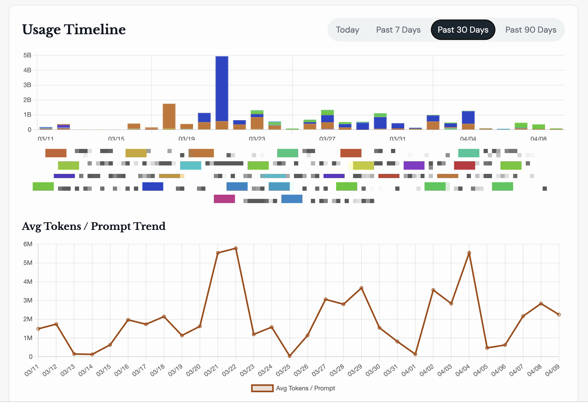

# TokenLeague

[English](README.md) | [简体中文](README_CN.md)

TokenLeague helps teams record token usage and prompt efficiency across AI coding assistants. It turns daily usage data into a shared dashboard so teams can review where tokens go, compare working patterns, and improve over time.

<p align="center">
  
</p>

## Why TokenLeague

- Give teams a simple, shared record of token usage by user, project, and model
- Make efficiency visible with usage timelines and average tokens-per-prompt trends
- Support retrospectives and self-improvement with concrete data instead of guesswork

## Features

- Precomputed leaderboard page for fast ranked views across tracked users
- User detail page with project breakdowns, model breakdowns, recent prompt events, and project-selectable trend charts
- Efficiency-focused views such as token timelines and average tokens per prompt
- Account page for rotating hook keys and changing local passwords
- Admin pages for user management, LDAP configuration, and observed agent catalog data
- Built-in installers and collectors for Claude Code, Codex CLI, Workbuddy, Gemini CLI, and OpenClaw
- Historical backfill scripts for Claude Code and Codex sessions
- English and Simplified Chinese UI copy

## Supported Ingestion Sources

- Claude Code
- Codex CLI
- Workbuddy / CodeBuddy CLI
- Gemini CLI
- OpenClaw

Detailed hook behavior and setup notes live in [docs/HOOKS.md](docs/HOOKS.md). Chinese overview: [README_CN.md](README_CN.md).

## Core Pages

- `/leaderboard`: default precomputed rankings
- `/users/<id>`: per-user detail view with project, model, and timeline analysis
- `/account`: self-service hook key and password management
- `/admin/users`: user creation, status changes, hook key rotation
- `/admin/ldap`: LDAP configuration, connection testing, and sync
- `/admin/agents`: observed agent/version/model catalog
- `/docs`: in-app documentation browser
- `/api`: route-derived API list

## Requirements

- Python 3.12+
- MySQL or MariaDB reachable from the app environment
- A writable `.env` file based on `.env.example`

`docker-compose.yml` does **not** provision a database container. Set `MY_APP_DB_HOST`, `MY_APP_DB_PORT`, `MY_APP_DB_NAME`, `MY_APP_DB_USER`, and `MY_APP_DB_PWD` to an existing database service before starting the app.

## Docker Compose (Recommended)

1. Copy the environment template and edit the database connection values:

```bash
cp .env.example .env
```

2. Initialize the database schema and bootstrap the admin account through the app image:

```bash
docker compose run --rm web python3 /app/scripts/init_db.py --admin-password '<strong-password>'
```

3. Start the web app and the leaderboard snapshot worker:

```bash
docker compose up --build -d
```

`docker-compose.yml` sets both services to `restart: unless-stopped`, so they come back automatically after the Docker daemon starts again. On Linux hosts, also enable Docker at boot so a full machine reboot restores the stack without manual intervention:

```bash
sudo systemctl enable --now docker
```

4. Open `http://localhost:5006/login` and sign in with:

- username: `admin`
- password: the password passed to `--admin-password`

5. Follow logs when needed:

```bash
docker compose logs -f web worker
```

The `worker` service refreshes the default leaderboard snapshot once on startup and then every hour. `/leaderboard` reads that snapshot instead of scanning all historical prompt events on every request.

## Local Python Setup

1. Create a virtual environment and install dependencies:

```bash
python3 -m venv .venv
source .venv/bin/activate
pip install -r service/requirements.txt
```

2. Copy the environment file and export it into your shell:

```bash
cp .env.example .env
set -a
source .env
set +a
```

3. Initialize the database and create the admin account:

```bash
python3 scripts/init_db.py --admin-password '<strong-password>'
```

4. Start the web app:

```bash
cd service
./run.sh
```

5. In another terminal, optionally start the snapshot worker so `/leaderboard` stays fresh:

```bash
python3 scripts/run_leaderboard_snapshot_worker.py
```

## Environment Variables

### Application and Database

| Variable | Required | Purpose |
| --- | --- | --- |
| `MY_FLASK_SECRET_KEY` | Yes | Flask session signing key |
| `MY_APP_DB_HOST` | Yes | Database host |
| `MY_APP_DB_PORT` | No | Database port, defaults to `3306` |
| `MY_APP_DB_NAME` | Yes | Database name |
| `MY_APP_DB_USER` | Yes | Database user |
| `MY_APP_DB_PWD` | Yes | Database password |
| `PORT` | No | HTTP port, defaults to `5006` |

The repository also accepts the legacy `MY_KMM_DB_*` aliases used by the migration and init scripts.

### Hook Runtime

| Variable | Required | Purpose |
| --- | --- | --- |
| `TOKENLEAGUE_HOOK_KEY` | Yes | Authenticates usage uploads for one user |
| `TOKENLEAGUE_API_URL` | No | Defaults to `http://localhost:5006` |
| `TOKENLEAGUE_GEMINI_CLI_VERSION` | No | Overrides Gemini version detection |
| `TOKENLEAGUE_OPENCLAW_VERSION` | No | Overrides OpenClaw version detection |

## Hook Installation

Repository hook templates live under `hooks/`. They are only activated when you run the installer.

Install every documented integration:

```bash
./scripts/install_hooks.sh --claude --codex --workbuddy --gemini --openclaw --global
```

Install only selected integrations:

```bash
./scripts/install_hooks.sh --claude --global
./scripts/install_hooks.sh --codex --global
./scripts/install_hooks.sh --workbuddy --global
./scripts/install_hooks.sh --gemini --global
./scripts/install_hooks.sh --openclaw --global
```

Install hooks into the current project instead of the user profile:

```bash
./scripts/install_hooks.sh --claude --codex --workbuddy --gemini --openclaw --local
```

Remove installed hooks:

```bash
./scripts/install_hooks.sh --claude --codex --workbuddy --gemini --openclaw --global --uninstall
```

Installer note:

- `--all` currently enables Claude Code and Codex CLI only
- use explicit flags when you also want Workbuddy, Gemini CLI, or OpenClaw

OpenClaw note:

- global OpenClaw installation also installs a `systemd` timer
- prefer `~/.openclaw/.env` for OpenClaw service environments

See [docs/HOOKS.md](docs/HOOKS.md) for detailed per-agent commands, file locations, and troubleshooting.

## Historical Backfill

Replay usage that was not uploaded when hooks originally ran:

```bash
python3 scripts/backfill_codex.py --dry-run
python3 scripts/backfill_claude.py --dry-run
```

Common options:

```bash
--dry-run
--days N
--limit N
--verbose
--root PATH
```

Default scan roots:

- Codex: `~/.codex/sessions`
- Claude Code: `~/.claude/projects`

Real uploads still require `TOKENLEAGUE_HOOK_KEY`.

## Development And Tests

Run the service test suite:

```bash
PYTEST_DISABLE_PLUGIN_AUTOLOAD=1 pytest -q service/tests
```

Useful targeted commands:

```bash
PYTEST_DISABLE_PLUGIN_AUTOLOAD=1 pytest -q service/tests/test_token_league.py
PYTEST_DISABLE_PLUGIN_AUTOLOAD=1 pytest -q service/tests/test_deploy_assets.py
```

## Repository Layout

```text
.
├── docs/                # in-app docs and operational guides
│   └── assets/          # README documentation images
├── hooks/               # hook and collector templates
├── scripts/             # init, migrations, workers, backfill, installers
├── service/             # Flask app, templates, tests
├── Dockerfile
├── docker-compose.yml
└── README_CN.md
```
